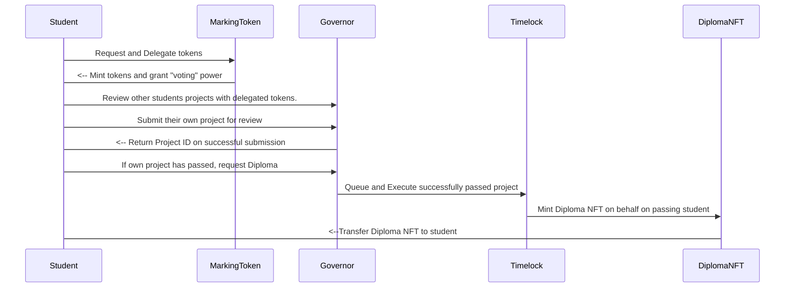

# DiplomaGuild

## Project Description
A [Peer Assessment](https://en.wikipedia.org/wiki/Peer_assessment) DAO where students will submit their project work for review/marking by other students. 

The DAO will be made of students studying the same subject/course where they will all eventually submit their work for review/marking. On submission, their work will be assessed by other students against a set criteria (provided by the teaching organisation).
 In order to be awarded their diploma, a project will require a "pass" from a % of the DAO and on passing a student will be awarded their diploma certificate
 
## Design Details
### Smart Contract Layer
The DAO is based on the [OpenZeppelin Governance](https://docs.openzeppelin.com/contracts/4.x/api/governance) model, and will use ERC20 tokens for voting.  On successfully passing, a student will be able to mint their Diploma certificate . This Diploma will be a non-transferable NFT (ERC721 token) ie. A pseudo "Soulbound" Token.

The DAO will also make use of [Timelock](https://docs.openzeppelin.com/contracts/4.x/governance#timelock) to ensure that the DAO remains 'trustless' and the execution of Diploma minting can only be performed the DAO if a project successfully passes and not directly by students or the teaching organisation.

### API Layer

### Frontend Layer

### Smart Contracts Addresses

The application utilises the following four smart contracts, which are all deployed to the **Sepolia** testnet, at the following addresses:
 - Marking Token (ERC20): [0x93530f913232EC2D46daE425E163fBc8eCC399c3](https://sepolia.etherscan.io/address/0x93530f913232EC2D46daE425E163fBc8eCC399c3)
 - DiplomaGuild (ERC721): [0xa4a229194FfB476803543f5f31df870ADb424E3F](https://sepolia.etherscan.io/address/0xa4a229194FfB476803543f5f31df870ADb424E3F)
 - Governor: [0x04a1239B94779B7Ab1fe73D8D8a56b1f0Ff652ED](https://sepolia.etherscan.io/address/0x04a1239B94779B7Ab1fe73D8D8a56b1f0Ff652ED)
 - Timelock: [0xA2A60855DA9dd518E84937db9a2ed5b9b673d8A8](https://sepolia.etherscan.io/address/0xA2A60855DA9dd518E84937db9a2ed5b9b673d8A8)


### High Level User Actions
#### Student
1. Login to application via their wallet.
2. Request Marking tokens so that they may be able to review/mark projects.
3. View
5. Add new deposit agreements.
6. For any newly tenanted properties (including renewals), view the received deposit amount.
7. For any 'end of tenancy' properties, make deductions and deposit releases.


## Project Structure
```
├── README.md
├── artifacts
├── assests
│   ├── DiplomaGuild.png
│   ├── DiplomaGuild.svg
│   └── metadata.json
├── backend
│   ├── dist
│   ├── nest-cli.json
│   ├── node_modules
│   ├── package-lock.json
│   ├── package.json
│   ├── src
│   ├── test
│   ├── tsconfig.build.json
│   ├── tsconfig.json
│   ├── vercel.json
│   └── yarn.lock
├── cache
├── contracts
│   ├── DiplomaGuildGov.sol
│   ├── DiplomaGuildNFT.sol
│   ├── DiplomaGuildProps.sol
│   ├── DiplomaGuildTimeLock.sol
│   └── MarkingToken.sol
├── frontend
│   ├── node_modules
│   ├── package-lock.json
│   ├── package.json
│   ├── postcss.config.js
│   ├── public
│   ├── src
│   ├── tailwind.config.js
│   └── tsconfig.json
├── hardhat.config.ts
|── node_modules
├── package-lock.json
├── package.json
├── scripts
│   ├── deploy_gov.ts
│   ├── generateNFTMetadata.ts
│   ├── gov.ts
│   ├── gov_v2.ts
│   ├── readStorage.ts
│   └── sepolia_dep.ts
├── tests
│   └── test.ts
├── tsconfig.json
└── yarn.lock
```
## Local Setup
> TODO: How to setup project locally and run it.

## Built by:
Built for the [Encode Solidity Bootcamp 2023](https://www.encode.club/solidity-bootcamps) by:
 - [Joshua Bloom](https://github.com/AlgoBloom) 
 - [Josh Leong](https://github.com/zkjet)
 - [Hardeep Nagra](https://github.com/w3ia)
 - [Chris Salvador](https://github.com/csalvador58)
