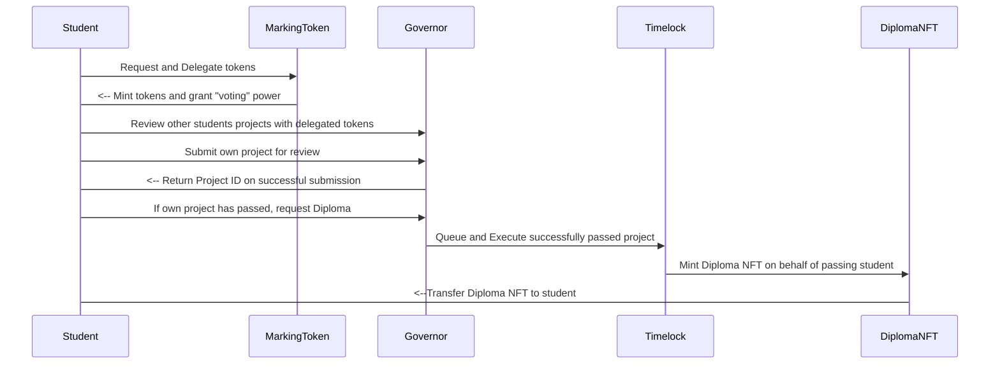

# DiplomaGuild

  

## Project Description

A [Peer Assessment](https://en.wikipedia.org/wiki/Peer_assessment) DAO where students submit their project work for review/marking by other students.

The DAO is made of students studying the same subject/course where they will all eventually submit their work for review/marking. On submission, their work will be assessed by other students against a set criteria (provided by the teaching organisation).

In order to be awarded their diploma, a project will require a "pass" from a % of the DAO and on passing a student will be awarded their diploma certificate.

## Design Details

### Smart Contract Layer

The DAO is based on the [OpenZeppelin Governance](https://docs.openzeppelin.com/contracts/4.x/api/governance) model uses ERC20 tokens for voting. On successfully passing, a student will be able to mint their Diploma certificate. This Diploma is a non-transferable NFT (ERC721 token) ie. A pseudo "Soulbound" Token.

  

The DAO makes use of [Timelock](https://docs.openzeppelin.com/contracts/4.x/governance#timelock) to ensure that the DAO remains 'trustless', and the execution of Diploma minting can only be performed the DAO if a project successfully passes and not directly by students or the teaching organisation.

  

#### Smart Contracts Addresses

The application utilises the following four smart contracts, which are all deployed to the **Sepolia** testnet, at the following addresses:

- Marking Token (ERC20): [0x93530f913232EC2D46daE425E163fBc8eCC399c3](https://sepolia.etherscan.io/address/0x93530f913232EC2D46daE425E163fBc8eCC399c3)

- DiplomaGuild (ERC721): [0xa4a229194FfB476803543f5f31df870ADb424E3F](https://sepolia.etherscan.io/address/0xa4a229194FfB476803543f5f31df870ADb424E3F)

- Governor: [0x04a1239B94779B7Ab1fe73D8D8a56b1f0Ff652ED](https://sepolia.etherscan.io/address/0x04a1239B94779B7Ab1fe73D8D8a56b1f0Ff652ED)

- Timelock: [0xA2A60855DA9dd518E84937db9a2ed5b9b673d8A8](https://sepolia.etherscan.io/address/0xA2A60855DA9dd518E84937db9a2ed5b9b673d8A8)
  
---
The following is a sequence diagram outlining the contract interactions:


---
### API Layer

To faciliate the Timelock aspect of the DAO i.e. Queuing and Execution, an API layer (running on https://nestjs.com/) is implemented with the following single end-point that will be called by the Application's front-end:

    POST /queue-and-lock
    
    Request Body:
    {
    	projectURL: <STRING>
    	studentAddress: <STRING>
    }
    
    Response:
    {
    	execution_tx_id: <STRING>
    }
    
### Frontend Layer
The frontend layer is a [react](https://react.dev/) based web app that permits the following actions for a user (Student):
1. Login to application via their wallet.
2. Request Marking tokens so that they may be able to review/mark projects.
3. Submit their own project and track its progress.
4. Request Diploma if project has passed.
5. Mark/review other student projects.

UI design/wireframes desgins are available from UI design/wireframes desgins are available from [diploma_dao_ui_wireframe.pdf](https://github.com/w3ia/Encode-Solidity-Bootcamp---Team-4-Final-Project/blob/main/diploma_dao_ui_wireframe.pdf)

## Project Structure
#### Smart Contracts (including deployment, test scripts and NFT assets):
```
├── contracts
│ ├── DiplomaGuildGov.sol
│ ├── DiplomaGuildNFT.sol
│ ├── DiplomaGuildProps.sol
│ ├── DiplomaGuildTimeLock.sol
│ └── MarkingToken.sol
├── scripts
│ ├── deploy_gov.ts
│ ├── generateNFTMetadata.ts
│ ├── gov.ts
│ ├── gov_v2.ts
│ ├── readStorage.ts
│ └── sepolia_dep.ts
├── tests
│ └── test.ts
├── assests
│ ├── DiplomaGuild.png
│ ├── DiplomaGuild.svg
│ └── metadata.json
```
#### API/Backend:
```
├── backend
│ ├── dist
│ ├── nest-cli.json
│ ├── node_modules
│ ├── package-lock.json
│ ├── package.json
│ ├── src
│ ├── test
│ ├── tsconfig.build.json
│ ├── tsconfig.json
│ ├── vercel.json
│ └── yarn.lock
```
#### Frontend:
```
├── frontend
│ ├── node_modules
│ ├── package-lock.json
│ ├── package.json
│ ├── postcss.config.js
│ ├── public
│ ├── src
│ ├── tailwind.config.js
│ └── tsconfig.json
├── hardhat.config.ts
|── node_modules
├── package-lock.json
├── package.json
```
## Local Setup
Project was built and tested against:
* Node v19.7.0
* Npm v9.5.0

* **Ensure dotenv is setup with team 4 keys/signers** 

#### Smart Contracts
1. From the repo root run ``npm install``
2. Once install is complete:
	 * To **compile** the contract(s) run: 
	 ``npx hardhat compile``
	 * To **test** the contract(s) run: 
	 ``npx hardhat --network hardhat test``
	 * To **run** contracts run: 
	 ``npx hardhat --network hardhat run scripts/gov_v2.ts``

#### API Backend:
 - Cd to the **backend** directory.
 - Run ``npm install``
 - Once install is complete:
	 * To start in **dev** the run: 
	 ``npm run start``
	 * To run in **watch** mode run:
	 ``npm run start:dev``
- Swagger API will be accessible via http://localhost:3001/api
	
#### **Frontend:**
 - Cd to the **frontend** directory.
 - Run ``npm install``
 - Once install is complete:
	 * To start, run: 
	 ``npm run start``
- App will be accessible via http://localhost:3000/

## Built by:

Built for the [Encode Solidity Bootcamp 2023](https://www.encode.club/solidity-bootcamps) by:

- [Joshua Bloom](https://github.com/AlgoBloom)

- [Josh Leong](https://github.com/zkjet)

- [Hardeep Nagra](https://github.com/w3ia)

- [Chris Salvador](https://github.com/csalvador58)
